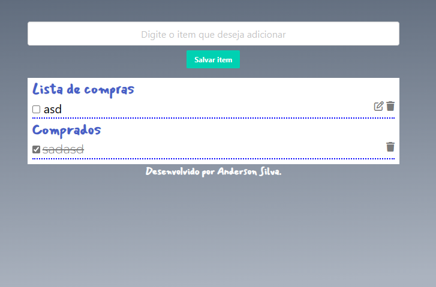

O código HTML cria uma página simples para gerenciar uma lista de compras. Ele consiste em um formulário para adicionar itens à lista, duas seções para exibir os itens (a lista principal e os itens comprados) e um rodapé.

    O arquivo main.js contém o código JavaScript que adiciona a funcionalidade à página. Vou explicar as principais partes do código:

                            Inicialização de variáveis:

    listaDeItens: uma matriz vazia que armazenará os itens da lista.
    itemAEditar: uma variável para rastrear o item sendo editado.
    Capturando elementos HTML:

form, itensInput, ulItens e ulItensComprados são variáveis que capturam elementos HTML correspondentes aos IDs especificados no HTML.
Recuperação da lista de itens do armazenamento local:

     listaRecuperada armazena os dados da lista de itens recuperados do armazenamento local,  se houver algum.

Se a lista existir, ela é convertida de volta em formato de matriz usando JSON.parse() e atribuída à variável listaDeItens.
Se não houver lista recuperada, listaDeItens é inicializada como uma matriz vazia.
Evento de envio do formulário:

-    O código adiciona um ouvinte de evento de envio ao formulário (form.addEventListener("submit", ...)).
-    Quando o formulário é enviado, a função anônima é executada.
A função chama evento.preventDefault() para evitar o comportamento padrão do formulário (recarregar a página).

-    Em seguida, chama salvarItem() para adicionar o item à lista.
Depois, chama mostrarItem() para atualizar a exibição da lista na página.
Por fim, chama itensInput.focus() para definir o foco de volta no campo de entrada.
Função salvarItem():

-     A função recupera o valor do item digitado no campo de entrada (itensInput.value).
Em seguida, verifica se o item já existe na lista usando o método some().
Se o item já existir, exibe um alerta informando que o item já está na lista.
Caso contrário, o item é adicionado à lista usando listaDeItens.push(), como um objeto com as propriedades valor (o nome do item) e checar (um valor booleano para indicar se o item foi marcado como comprado).
O campo de entrada é limpo após adicionar o item.

Função mostrarItem() (continuação):

-       Se o item estiver marcado como comprado, o elemento <li> correspondente é adicionado à seção de itens comprados (ulItensComprados). Ele contém uma caixa de seleção (<input type="checkbox">), um texto com o valor do item () e um ícone de lixeira para excluir o item (<i class="fa-solid fa-trash is-clickable deletar"></i>).
Se o item não estiver marcado como comprado, o elemento <li> correspondente é adicionado à seção da lista principal (ulItens). Ele contém uma caixa de seleção, um campo de texto com o valor do item (que pode ser editado), um ícone de edição para editar o item (<i class="fa-regular is-clickable fa-pen-to-square editar"></i>) e um ícone de lixeira para excluir o item.
-       Dependendo se o item está sendo editado ou não, os elementos são renderizados com atributos adicionais como disabled para impedir a edição.
Manipulação de eventos:

-       O código adiciona ouvintes de eventos para os elementos interativos, como caixas de seleção, ícones de edição e ícones de exclusão.
Quando a caixa de seleção é clicada, o valor correspondente é atualizado na matriz listaDeItens e a função mostrarItem() é chamada para atualizar a exibição.
Quando o ícone de exclusão é clicado, o item correspondente é removido da matriz listaDeItens e a função mostrarItem() é chamada para atualizar a exibição.
Quando o ícone de edição é clicado, o item correspondente é marcado para edição, e a função mostrarItem() é chamada para atualizar a exibição.
Quando o botão de salvar edição é clicado, o valor do item editado é salvo na matriz listaDeItens, e a função mostrarItem() é chamada para atualizar a exibição.
Função atualizaLocalStorage():

Essa função é responsável por atualizar os dados da lista de itens no armazenamento local.
Ela usa o método localStorage.setItem() para armazenar a lista convertida em formato JSON.
